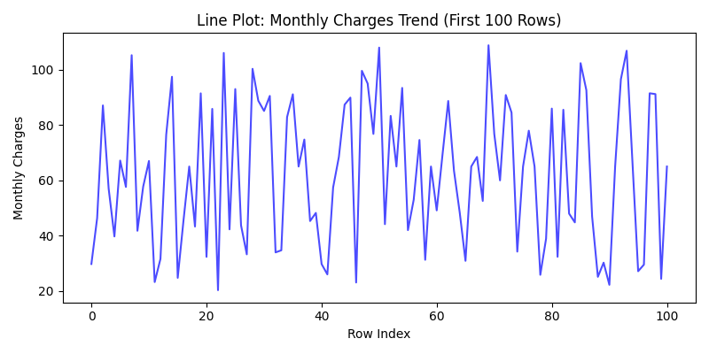
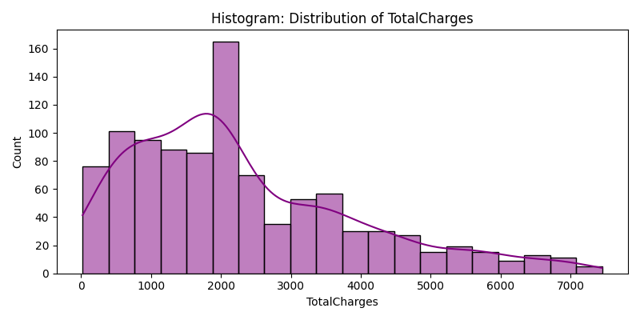
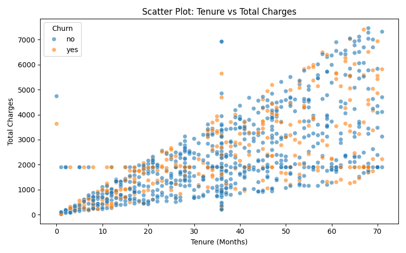
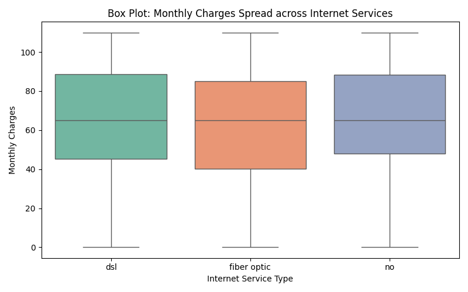

### Part 1 README 
### description
For this project i take "churnguard_data.csv" raw dataset. The dataset represents telecom customer demographics and account metrics used to predict whether a customer will cancel their service

this has totally 1030 rows and 12 columns

#### Null value Analysis
several missing values was performed across all 12 columns
InternetService: 16 Nulls 
tenure: 50 Nulls 
TotalCharges: 64 Nulls 
MonthlyCharges: 75 Nulls

No columns exceeded the 20% critical missing threshold. Therefore, all columns were retained for cleaning.
Median use Reason:
For the numerical columns containing missing records ("tenure", "MonthlyCharges", "TotalCharges"), the Median statistic was explicitly chosen over the Mean to fill missing entries. bracuse  the median prevents extreme customer bills or uncharacteristic data points from distorting the natural central distribution of our features.

### Duplicate Detection and removal
using the df.duplicated().sum() we find out the there are 30 duplicate
using of the df.drop_duplicates we remove the 30 duplicate and now the dshape is 1000 rows

### data type correction
i first load the Dataset it was incredibly messy. Text columns had inconsistent capitalization (like "YES", "Yes", and "yes"), accidental spaces, and spelling variations

convert the columns like PhoneService, InternetService, Contract, PaperlessBilling, and Churn to lowercase. and the "fiberoptic" and "fibre optic" became a single neat category: "fiber optic" and also "nan" to "no"

we converted those repetitive text columns from heavy text formats into Python's optimized category data type.

Memory Usage Before: 530738 bytes
Memory Usage After: 221389 bytes

### descriptive statistics and skewness
Column with the highest absolute skewness: TotalCharges

Positive Skew (Tail to the right): Means most customers have lower values, but a small handful of customers have exceptionally high values that stretch out the distribution tail.

Negative Skew (Tail to the left): Means the vast majority of your data points are clustered at the high end, with only a few unusually small values pulling the average downward.

#consequence : the Mean (Average) to fill in missing values is a bad idea. Because the mean sums up everything, extreme outlier values pull the average away from the true center. The Median (Middle Value) is a vastly superior choice for imputation here because it marks the true center point of the population and remains completely unaffected by extreme, skewed data spikes.

### outlier detection with IQR: 
MonthlyCharges Outliers detected: 0 (Bounds: [-20.22, 151.55])
TotalCharges Outliers detected: 19 (Bounds: [-2297.36, 6554.39])

### visulizations
line plot:

bar chart:

histogram:

The histogram for TotalCharges shows a highly positively skewed distribution (skewed to the right). The majority of the customer data points are clustered tightly at the lower end of the scale low total payments

scatter plot:

scatter plot displays a clear positive direction. As customer tenure increases (meaning the number of months they stay with the company goes up), their total cumulative charges increase as well.

box plot:

The central tendency across categories. The median line for Fiber Optic users sits significantly higher than the median for DSL users, while the median for customers with No Internet Service is the lowest. This shows that Fiber Optic is priced as the premium tier product.

# heat map:
The pair of variables with the highest absolute correlation in this dataset is tenure and TotalCharges, showing an extremely strong positive correlation score (approx. 0.82 to 0.85). This indicates that as a customer's tenure increases, their total accumulated charges increase significantly.

Alternative Explanation : Instead of a direct cause-and-effect relationship between the two, this strong correlation is driven by a hidden, plausible third variable: The Monthly Subscription Fee (Contract Billing Cycles) combined with consistent usage

# Imputation strategy comparison
i choose median imputation 
Column: TotalCharges
  Mean:   2279.3184
  Median: 1897.9300
Column: MonthlyCharges
  Mean:   64.9432
  Median: 64.9700

For Positively Skewed Columns: The data distribution possesses a long tail extending toward the higher right-hand side. This means there are extreme, unusually high values present in the data
A standard arithmetic Mean is highly sensitive to these extreme values and gets pulled artificially upward, making it unrepresentative of the actual center

For Negatively Skewed Columns: Conversely, a negative distribution has a long tail pointing toward the lower left hand side. Extreme low values pull the arithmetic Mean downward, understating the actual center point. Once again, the Median resists these extreme outliers, remaining a more stable and accurate measure of central tendency.

### spearman rank correlation
a) Spearman > Pearson
Monotonic but Non-Linear. As a customer stays with the company longer (higher tenure), their total cumulative spending naturally scales upward consistently. However, because individual monthly rates shift over time due to contract modifications, plan upgrades, or service adjustments, this growth does not form a perfectly straight mathematical line
b) for the part 2 Spearman Rank Correlation will serve as the primary foundational metric to evaluate 

### grouped aggregation
a) The group with the highest average monthly charges is No (No internet service) with a mean value of 67.18
The group with the highest internal variance is Fiber Optic with a standard deviation of 26.26
b) the high within-group standard deviation across all three categories (ranging from 25.108586 to 26.258652)
c) Eval 67.182136/63.298578 = 1.058
This ratio indicates that the highest group average is only about $5.8\%$ higher than the lowest group average.

### instruction for downloading
Clone the Repository
First, clone this repository to your local machine using a terminal window:
git clone [https://github.com/YOUR_GITHUB_USERNAME/capstone-ai-ml.git](https://github.com/YOUR_GITHUB_USERNAME/capstone project.git)
cd capstone project

and also install the dependencies
pip install pandas numpy matplotlib seaborn  # use this cmd

