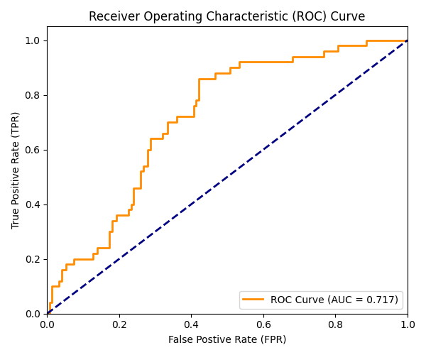

### part 2 README
### task 1:
we split the dataset into two seperate task specific target labels X and y
Regression target y_reg (MonthlyCharges)
definition:A continuous numeric column representing the exact amount billed to a subscriber on a monthly basis
classification: target y_clf (churn)
definition:A binary target vector created by scanning the cleaned `Churn` column. It converts the text string yes into a 1 (representing a customer who canceled their contract) and no into a 0 (representing a loyal customer who renewed their contract) using the .astype(int) vector command.
we drop the customerID completely to prevent models from memorizing arbitrary tracking patterns.

### task2:
mapping: `{'month-to-month': 0, 'monthly': 0, 'one year': 1, 'two year': 2}`
explanation: The contract type represents a clear, ascending commitment structure. A user on a month-to-month plan has zero commitment stability, a one-year contract guarantees intermediate baseline stability, and a two-year contract reflects maximum financial and operational loyalty. Mapping these to sequential integers (0, 1, 2) preserves this natural structural rank for the model equations.
One-Hot Encoding:
Processed using pd.get_dummies(..., drop_first=True) and cast to pure integers.
The False-Ordinal-Relationship Problem Avoided:** Features like `PaymentMethod` (e.g., Electronic Check, Bank Transfer, Mailed Check) have no natural hierarchy or inherent numeric superiority. If we applied basic label encoding here (e.g., assigning Electronic Check = 1, Bank Transfer = 2, Mailed Check = 3), the machine learning algorithms would be tricked into interpreting a mathematical relationship where Mailed Check is "three times greater" than an Electronic Check. This introduces a **false ordinal relationship**, causing severe calculation distortion. One-hot encoding transforms each distinct word into its own independent true/false ($1/0$) dummy switch, giving each category equal structural weight.
*   **Why `drop_first=True` is Required:** For a binary category like gender, creating two columns (gender_Female and gender_Male) is highly redundant. If gender_Female is 0, the customer must be male 1. Keeping both columns creates a data trap called multicollinearity (the dummy variable trap), which causes mathematical instability in regression models. Dropping the first dummy column keeps the dataset light, compact, and mathematically stable.
so the drop_first=True is Required: For a binary category like gender, creating two columns (gender_Female and gender_Male) is highly redundant. If gender_Female is 0, the customer must be male 1. Keeping both columns creates a data trap called multicollinearity (the dummy variable trap), which causes mathematical instability in regression models. Dropping the first dummy column keeps the dataset light, compact, and mathematically stable.

### task 3:Leak-Free train-test and Scaling
The feature matrix X and both targets were partitioned into training subsets (80) and test subsets (20) using a locked random_state=42 to guarantee exact, peer-reproducible shuffling splits.
Feature scaling via StandardScaler was applied using a strict sequence: the scaler was fitted exclusively on the training features ("scaler.fit(X_train)"), and then used to transform both subsets. 

If scaler.fit() were executed on the entire dataset before the train-test split, the global mean and standard deviation calculation would include statistics belonging to the future test set exam rows. Information from the locked test exam would bleed backward into the training room. This is a severe error known as Data Leakage. It causes the model to artificially overperform during development but fail catastrophically when deployed onto true real-world unseen data, because it secretly cheated during training.

### task 4:Regression model-linear Regression:
Large Positive Coefficient Means: the scaled feature goes up by one unit, the model's final prediction will jump up by that exact weight value (in dollars), as long as everything else stays the same. For us, every 1-unit increase in scaled TotalCharges means the model adds an extra $25.55 to the estimated monthly bill.
Large Negative Coefficient Means: It means the exact opposite. If a scaled feature goes up by one unit, the model's final prediction will drop down by that weight value. For example, for every 1-unit increase in scaled customer loyalty (tenure), the model slashes $18.37 off the predicted monthly bill

Ridge Regression acts like a smart supervisor. It uses a setting called alpha=1.0 to add a penalty that stops any single feature from getting a crazy, unrealistic weight (\(L2\) regularization). You can think of the alpha parameter as a noise-filter knob: turning it up keeps the model's weights close to reality and stops it from panicking over noisy data. Because our data had some messy, duplicate space columns (like PaymentMethod_  Electronic check), plain OLS got confused and overreacted. Ridge stepped in, calmed the math down, smoothed out the noise, and gave us a better coefficient profile. This is exactly why Ridge achieved a lower error (MSE dropped to 354.6856) and better real-world guessing accuracy (R^2) climbed to 44.58%)

### task 5: Classification model — Logistic Regression
a):Precision = TP / TP + FP  Recall = TP / TP + FN
TP (True Positive): A customer who actually cancelled, and the model correctly caught them.
FP (False Positive / False Alarm): A loyal customer who wanted to stay, but the model flagged them as a risk by mistake.
FN (False Negative / Missed Threat): A customer who cancelled quietly because the model completely missed them.

b): for this our classification report, our default model scored a Precision of 38% and a massive Recall of 86%. For this customer churn project, Recall is dramatically more important than Precision.

False Negative (Low Recall): If our model suffers from low recall, it means we are blind to quiet threats. A customer cancels their contract, packs up, and leaves because our model missed them completely. The company loses their entire recurring revenue stream forever, and it will cost a lot of marketing money to find a new replacement customer.

 False Positive (Low Precision): If our model suffers from low precision, it means it generates a high false-alarm rate. It mistakenly flags a loyal customer as "at-risk." The penalty here is tiny—the marketing team simply sends them a friendly retention email or a small coupon. The loyal customer is happy to get a discount, and they remain with the company.

c): my  baseline model achieved an AUC score of 0.7165 (71.65%)
The AUC measures the overall intelligence of your model's classification radar. A score of 0.5000 means your model is completely blind and guessing randomly like a coin flip. A perfect score of 1.0000 means a flawless model that catches 100% of threats with zero false alarms.
my score of 0.7165 means my model has a solid

ROC Curve virstual:

### b) Decision-threshold sensitivity:
a): Precision = TP / TP + FP  Recall = TP / TP + FN
b): look closely at the sensitivity table, the thresholds that maximize the F1-Score are 0.40 and 0.50.
They represent the perfect mathematical middle ground where the system manages to catch a high amount of threats while keeping random false alarms stable.
c): For a subscription business trying to prevent cancellations, Recall is hands-down more important than Precision.
detail:
Missing a threat (Low Recall): If a customer cancels their subscription because our model completely missed them, we lose their entire financial lifetime value permanently.
A False Alarm (Low Precision): If our model triggers a false alarm and flags a loyal user by mistake, the penalty is tiny. We just send them an automated, friendly customer retention email or a small discount offer. The loyal customer is happy to get a discount, and they remain with the company anyway.
d): 0.40 or 0.30 to optimize for high Recall yeah we can do that we have both sides:
Benefit: Dropping the fence down to 0.30 pushes our Recall up to its highest score of 88.00%. This means we successfully catch and save 44 out of our 50 real cancellers before they walk out the door
Cost: The trade-off or "cost" of doing this is that our Precision drops to its lowest score of 36.67%. Our list will be flooded with more false alarms, meaning the marketing team will spend extra resources sending discount offers to loyal customers who were never planning to leave anyway. But mathematically, saving those extra high-value accounts easily outweighs the cost of the extra emails

### task 6: Regularization experiment on logisitic regression:
C down from its standard factory default of 1.0 down to 0.01.
A large C (1.0) gives the model a very loose, long leash. The model is free to study every tiny detail in your training data, but it runs the risk of memorizing raw noise and overfitting.

A small C (0.01) pulls that leash incredibly tight. It applies a heavy penalty to the math, forcing the algorithm to shrink its feature weights down close to zero. This keeps the math simple, prevents the model from relying too heavily on any single column, and forces it to focus only on big, reliable trends.

on my specific customer dataset, reducing C down to 0.01 successfully improved our modeles performance

at my evaluation radar score (AUC), my standard baseline model scored a 0.7165, but my new regularized model jumped up to 0.7324. This upgrade tells us that my original model was over-complicating things and accidentally memorizing random noise in the training room. By applying the tight C=0.01 restriction rope, we forced the math to stay grounded and focus on core trends. This simple, big-picture focus paid off massively, making the model much smarter at separating churning customers from loyal ones when faced with completely unseen test data.

### task 7: Bootstrap confidence interval for AUC difference:
The Three Numbers:
Mean AUC Difference: -0.0149
Lower Boundary: -0.0414
Upper Boundary: 0.0092

[-0.0414, 0.0092], the interval includes zero. It starts on the winning negative side but crosses over the zero line to end on a positive number.

The negative average score (-0.0149) proves that the regularized model (C=0.01) is the superior worker on average. It maintains a steady 1.49% accuracy advantage across most shuffles because its math is simpler and cleaner. Because the right side of our bracket hits a positive number (0.0092), it warns us that the battle is incredibly close. There are still a few unusual, unique mixes of customers where the baseline model can bounce back and get a localized win.

